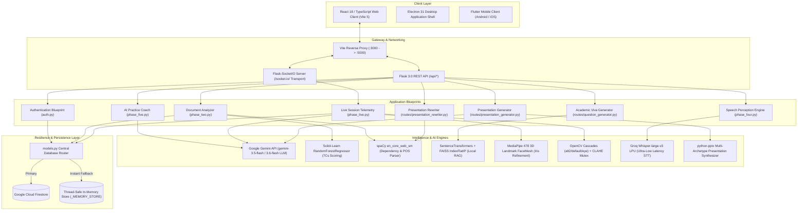

# Presenova: AI-Powered Multi-Modal Presentation Evaluation, Coaching & Synthesis Platform
## Master Technical Specification, System Architecture & Engineering Reference
**Release 1.1.0 — Final Year Project (FYP)**

---

### Table of Contents
1. [Executive Summary & Problem Formulation](#1-executive-summary--problem-formulation)
2. [System Architecture & High-Level Design](#2-system-architecture--high-level-design)
3. [Core Subsystems & Technical Pipelines](#3-core-subsystems--technical-pipelines)
   - [3.1 Phase 1: Authentication & Identity Management (`auth.py`)](#31-phase-1-authentication--identity-management-authpy)
   - [3.2 Phase 2: Slide Intelligence & 7Cs Communication Framework (`phase_two.py`)](#32-phase-2-slide-intelligence--7cs-communication-framework-phase_twopy)
   - [3.3 Phase 3: Presentation Synthesis & Rewriter Engines (`services/presentation_generator.py` & `routes/presentation_rewriter.py`)](#33-phase-3-presentation-synthesis--rewriter-engines-servicespresentation_generatorpy--routespresentation_rewriterpy)
   - [3.4 Phase 4: Acoustic Perception & Speech Processing (`phase_four.py`)](#34-phase-4-acoustic-perception--speech-processing-phase_fourpy)
   - [3.5 Phase 5: AI Practice Coach — Dr. Alexander Vance (`phase_five.py`)](#35-phase-5-ai-practice-coach--dr-alexander-vance-phase_fivepy)
   - [3.6 Phase Live: Real-Time Computer Vision & Panelist Defense (`phase_live.py`)](#36-phase-live-real-time-computer-vision--panelist-defense-phase_livepy)
   - [3.7 Academic Viva Defense RAG Question Generator (`routes/question_generator.py`)](#37-academic-viva-defense-rag-question-generator-routesquestion_generatorpy)
4. [Dual-Persistence Database Architecture (`models.py`)](#4-dual-persistence-database-architecture-modelspy)
5. [Complete REST & WebSocket API Directory](#5-complete-rest--websocket-api-directory)
6. [Complete Codebase Map & Directory Structure](#6-complete-codebase-map--directory-structure)
7. [Developer Setup, Installation & Running Guide](#7-developer-setup-installation--running-guide)
8. [Final Year Project (FYP) Viva Voce Defense Cheatsheet](#8-final-year-project-fyp-viva-voce-defense-cheatsheet)
9. [Document Revision Changelog](#9-document-revision-changelog)

---

## 1. Executive Summary & Problem Formulation

### 1.1 The Problem
Public speaking, academic thesis defense, and executive briefings are foundational communication competencies. However, conventional feedback mechanisms suffer from three critical bottlenecks:
1. **Subjectivity and Variance**: Human evaluation is anecdotal, qualitative, and varies widely across reviewers.
2. **Evaluation Latency**: Post-presentation critiques disconnect feedback from the exact timestamp of acoustic or physical errors.
3. **Domain Isolation**: Existing automated tools analyze text (grammar linters), audio (speech-to-text engines), or video (webcam engagement apps) in silos, failing to unify content rigor, vocal pacing, and biometric composure into an integrated evaluation framework.

### 1.2 The Presenova Solution
**Presenova** is an integrated, multi-modal presentation intelligence platform engineered to provide **deterministic scoring, real-time telemetry, automated deck synthesis, and simulated academic defense**. The platform analyzes presentations across three distinct pillars:

| Dimension | Physical Domain | Technologies & Telemetry | Presenova Output |
| :--- | :--- | :--- | :--- |
| **The Artifact** | Slides & Written Structure | Python-PPTX, spaCy NLP, Scikit-Learn RandomForest, 7Cs Framework, 5 Sub-Analyzers | 7Cs Radar Scorecard, Structural Rigor, Density Metrics, Color Contrast |
| **The Voice** | Acoustic Delivery & Cadence | Groq Whisper LPU, Librosa, WebM Audio Chunking | Real-Time WPM (Cadence), Verbal Filler Counter, Pause Dynamics |
| **The Speaker** | Physical Presence & Biometrics | MediaPipe FaceMesh (478 3D Landmarks), OpenCV Haar Cascades, CLAHE | Eye Gaze Deviation %, Head Orientation (Yaw/Pitch), Posture Alignment, Facial Emotion |

---

## 2. System Architecture & High-Level Design

Presenova employs a hybrid edge-cloud architecture designed for low-latency feedback streaming and resilient offline degradation:



---

## 3. Core Subsystems & Technical Pipelines

### 3.1 Phase 1: Authentication & Identity Management (`auth.py`)
- **Dual Authentication Mechanism**:
  - **Native Credentials**: Email and password authentication secured via salted password hashing.
  - **Google Firebase OAuth**: The client authenticates via the Firebase Web SDK and exchanges the resulting ID token with `POST /api/auth/firebase-login`. The server verifies token claims using `firebase_admin.auth.verify_id_token()`. In local development (`FLASK_ENV=development`), an unverified claims fallback engages automatically if Google Cloud authentication experiences network partition or clock skew.
- **JWT Architecture**:
  - Utilizes `Flask-JWT-Extended` with 24-hour access token validity and refresh token rotation.
  - Centralized error handlers (`@jwt.expired_token_loader`, `@jwt.invalid_token_loader`, `@jwt.unauthorized_loader`) sanitize all responses, preventing raw exceptions or internal stack traces from surfacing in client payloads.

### 3.2 Phase 2: Slide Intelligence & 7Cs Communication Framework (`phase_two.py`)
- **Supported File Ingestion**: `.pptx`, `.pdf`, `.docx`, `.txt`.
- **Magic-Byte Binary Verification**: Validates file header signatures (`PK\x03\x04` for PPTX/DOCX, `%PDF-` for PDF) to protect against malicious MIME-type spoofing.
- **The 7Cs Communication Framework**:
  1. **Clarity**: Flesch-Kincaid Reading Ease, Gunning Fog Index, syntactic complexity.
  2. **Conciseness**: Word count density and bullet thresholding (penalizing >6 bullets per slide).
  3. **Concreteness**: Extraction of empirical metrics, quantitative data points, dates, and named entities.
  4. **Correctness**: Grammatical syntax verification and passive voice ratio.
  5. **Coherence**: Discourse marker detection (`therefore`, `consequently`, `furthermore`) and topic flow.
  6. **Completeness**: Structural section detection (Agenda, Problem Statement, Methodology, Results, Conclusion).
  7. **Courteousness**: Sentiment polarity, tone objectivity, and professional voice.
- **Integrated Sub-Analyzers (`services/analysis/`)**:
  - `visuals.py`: Slide layout balance, whitespace ratio, and text-to-canvas density.
  - `sentiment.py`: Emotional polarity, executive confidence tone, and persuasion vectors.
  - `pacing.py`: Slide transition timing, content rhythm, and structural tempo.
  - `delivery.py`: Presentation impact estimation, key takeaway emphasis, and call-to-action prominence.
  - `narrative.py`: Storytelling arc detection (Problem -> Conflict -> Solution -> Impact).
- **Deterministic Offline ML Scoring (`nlp_module/`)**:
  - Evaluates slides using a pre-trained Scikit-Learn `RandomForestRegressor` (`nlp_module/trained_weights.pkl`) operating on 19 linguistic and structural features.
  - Operates completely offline with zero API latency and zero cost per evaluation.

### 3.3 Phase 3: Presentation Synthesis & Rewriter Engines (`services/presentation_generator.py` & `routes/presentation_rewriter.py`)

#### A. AI Presentation Generator
- **Dual-Mode Outline Synthesis**:
  - **Cloud Mode (Primary)**: Uses `GeminiProvider` (`gemini-3.6-flash` / `gemini-3.5-flash`) via `_generate_with_gemini()` to synthesize rich, context-specific slide outlines with key takeaways, data points, and speaker notes.
  - **Local Template Engine (Fallback)**: If `FORCE_OFFLINE_MODE=1` or the external API is unreachable, the system automatically falls back to an enriched local generator with curated domain banks (Healthcare, AI/Tech, Business/Finance, Default).
- **11 Layout Archetypes**:
  1. `title`: Clean title layout with executive subtitle and presenter metadata.
  2. `horizontal_pills`: 3-card architectural/thematic pillar overview.
  3. `swot`: 4-quadrant strategic matrix (Strengths, Weaknesses, Opportunities, Threats).
  4. `chart`: Programmatically generated Matplotlib/python-pptx charts (Bar, Donut, Line).
  5. `circular_dials`: KPI progress dials displaying percentage metrics.
  6. `process_chevrons`: 4-phase sequential workflow chevrons.
  7. `team_personas`: Executive profile cards with headshot frames, titles, and bio snippets.
  8. `stat_callout`: High-impact quantitative KPI callouts (`94%`, `3.8x`, `100%`).
  9. `timeline`: Implementation roadmap cards across time horizons.
  10. `editorial_split`: High-resolution imagery split layout with key insight bullets.
  11. `conclusion`: Executive summary takeaways and immediate stakeholder next steps.
- **Subscription Tiers & Evaluator Bypass**:
  - **Free Trial**: Generates **5, 10, or 15 slides**.
  - **Pro Tier**: Generates **20 slides** for comprehensive academic thesis defenses and enterprise keynotes.
  - **Evaluator Bypass Toggle**: An administrative demonstration control within the presentation generator interface that sets `localStorage.setItem('presenova_is_pro', 'true')`, allowing academic examiners and evaluators to test 20-slide synthesis on demand without payment configuration.

#### B. Presentation Rewriter
- **spaCy Rule-Based Engine (`services/rewrite/spacy_rewriter.py`)**:
  - Employs `en_core_web_sm` to perform deterministic `nsubjpass` dependency parsing for passive-to-active voice conversion.
  - Executes regex-based filler phrase substitution across 12 standard verbosity patterns (e.g., `in order to` -> `to`, `due to the fact that` -> `because`).
  - Applies 6x6 bullet splitting to prevent cognitive overload.

### 3.4 Phase 4: Acoustic Perception & Speech Processing (`phase_four.py`)
- **Speech Pipeline**:
  - Accepts `.wav`, `.mp3`, `.m4a`, and `.webm` audio recordings.
  - Transcribes audio slices via **Groq Whisper API** (`whisper-large-v3` running on Groq LPUs, delivering transcription in <400ms).
  - Graceful Degradation: When `GROQ_API_KEY` is not configured, speech analysis gracefully flags `stt_available: false` without throwing HTTP 500 errors.
- **Quantitative Metrics**:
  - **Cadence (WPM)**: Words-Per-Minute scoring against presentation benchmarks (Optimal: 130–155 WPM; Too Slow: <115 WPM; Too Fast: >165 WPM).
  - **Filler Word Density**: Real-time counter identifying disfluencies (`um`, `uh`, `like`, `you know`, `actually`, `basically`, `sort of`).
  - **Pause Ratio**: Measures silence density to encourage deliberate pacing over rapid vocalization.

### 3.5 Phase 5: AI Practice Coach — Dr. Alexander Vance (`phase_five.py`)
- **Persona Role: The Mentor**:
  - **Dr. Alexander Vance** serves as the user's supportive, constructive practice mentor.
  - Delivers concise, conversational coaching restricted to **under 75 words (2–4 sentences or 2 bullet points)**.
  - Evaluates user queries, provides actionable communication tips, and bridges technical questions back to presentation delivery and thesis defense.
- **Dual Engine Architecture**:
  - **Primary Engine**: Google Gemini 3.5 Flash via `services/ai/gemini_provider.py` (`thinking_budget=0` for immediate zero-delay output, cascading across `3.6-flash`, `flash-latest`, and `flash-lite-latest` on rate limits or 503 errors).
  - **Local Engine (Fallback)**: When offline, automatically switches to `services/coach_intent_engine.py` (TF-IDF vectorizer + LogisticRegression intent classifier) to supply structured practice recommendations without repetitive greetings.
- **LanguageTool Grammar Pre-Pass**:
  - Evaluates user input against cloud grammar rules to flag syntax, capitalization, and punctuation errors.

### 3.6 Phase Live: Real-Time Computer Vision & Panelist Defense (`phase_live.py`)
- **WebSocket Protocol Architecture**:
  - Built on Flask-SocketIO using the transport path `/socket.io/` and dedicated namespace `/ws/live-session`.
- **Thread-Safety & Concurrency Hardening**:
  - **`_vision_lock`**: Dedicated mutex (`threading.Lock()`) protecting OpenCV `CascadeClassifier` and CLAHE adaptive histogram equalization, preventing multi-threaded C++ heap corruption (`0xc0000374 STATUS_HEAP_CORRUPTION`).
  - **Frame Backpressure Guard (`_active_frame_sessions`)**: Automatically drops incoming frames if a prior frame for the same session is actively processing in the computer vision pipeline. This prevents thread accumulation, CPU starvation, and frame latency drift.
  - **Stateless FaceMesh**: MediaPipe configured with `static_image_mode=True` and detection confidence `0.30`, eliminating TensorFlow Lite feedback manager tensor crashes on snapshot frames.
  - **Client ReadyState Guard**: Frontend validates `video.readyState >= 2 && video.videoWidth > 0` before emitting frames, eliminating black frame bursts during webcam warm-up.
- **Biometric Telemetry**:
  - **Iris Gaze Deviation**: Uses landmarks 468–477 to calculate horizontal iris displacement:
    $$\text{Ratio}_H = \frac{X_{\text{iris}} - X_{\text{inner\_corner}}}{X_{\text{outer\_corner}} - X_{\text{inner\_corner}}}$$
    (Target: 0.50) and vertical iris displacement:
    $$\text{Ratio}_V = \frac{Y_{\text{iris}} - Y_{\text{top\_eyelid}}}{Y_{\text{bottom\_eyelid}} - Y_{\text{top\_eyelid}}}$$
    (Target: 0.42).
  - **Posture Composure**: Evaluates head center deviation ($dev_x, dev_y$), eye tilt angle, and distance sizing.
  - **Facial Emotion**: Categorizes emotional state (Confident, Focused, Distracted, Nervous).
- **Persona Role: The Inquisitor — Prof. Eleanor Vance**:
  - **Prof. Eleanor Vance** serves as the adversarial Senior Academic Defense Examiner.
  - Triggered after 45–60 seconds or upon detecting excessive filler words.
  - Formulates sharp, probing viva cross-examination challenges using Google Gemini (or deterministic academic challenge templates if offline) based on the presenter's recent spoken transcript.

### 3.7 Academic Viva Defense RAG Question Generator (`routes/question_generator.py`)
- **100% Local RAG Architecture (`services/viva_rag_engine.py`)**:
  - Operates completely locally without external LLM dependencies.
  - Chunks document text into semantic 200-word passages.
  - Embeds passages using `SentenceTransformer('all-MiniLM-L6-v2')`.
  - Indexes dense vectors in an in-memory `FAISS IndexFlatIP` (Cosine Similarity) index.
  - Extracts key technical entities using `spaCy` noun chunks.
- **Three-Tier Question Synthesis**:
  - **Tier 1 (Foundations & Terminology)**: Core definitions, architectural components, and taxonomy.
  - **Tier 2 (Methodology & Empirical Rigor)**: Dataset validity, algorithm trade-offs, and metric baselines.
  - **Tier 3 (Critical Edge-Cases & Scalability)**: System vulnerabilities, failure modes, and commercial viability.

---

## 4. Dual-Persistence Database Architecture (`models.py`)

Presenova utilizes a unified database router providing transparent fallback between cloud storage and local memory:

```
           +---------------------------------------+
           |         API Request / Action          |
           +---------------------------------------+
                               |
                               v
           +---------------------------------------+
           |       models.py Database Router       |
           +---------------------------------------+
                               |
               +---------------+---------------+
               |                               |
               v (Primary)                     v (Fallback / Offline)
    +----------------------+       +-----------------------+
    | Google Cloud         |       | Thread-Safe In-Memory |
    | Firestore Database   |       | Store (_MEMORY_STORE) |
    +----------------------+       +-----------------------+
               |                               |
        (If timeout/error)                     |
               +-------------------------------+
```

| Entity | Primary Cloud Storage | Offline In-Memory Fallback | Synchronization Model |
| :--- | :--- | :--- | :--- |
| **`User`** | Collection `users` | `_MEMORY_STORE["users"]` | Automatic seamless fallback on Firestore timeout |
| **`Upload`** | Collection `uploads` | `_MEMORY_STORE["uploads"]` | Metadata in memory; binary files on local filesystem |
| **`Report`** | Collection `reports` | `_MEMORY_STORE["reports"]` | Complete 7Cs evaluation JSON stored in memory |
| **`PresentationSession`**| Collection `presentation_sessions`| `_MEMORY_STORE["presentation_sessions"]`| Asynchronous background thread updates metrics |
| **`HistoricalReport`** | Collection `historical_reports`| `_MEMORY_STORE["historical_reports"]`| Multi-session topic comparison matrix |

---

## 5. Complete REST & WebSocket API Directory

### 5.1 Authentication API (`/api/auth`)
| Method | Endpoint | Auth | Description |
| :--- | :--- | :--- | :--- |
| `POST` | `/api/auth/signup` | None | Register new user via name, email, and password |
| `POST` | `/api/auth/login` | None | Authenticate with email/password; returns JWT access/refresh tokens |
| `POST` | `/api/auth/firebase-login` | None | Authenticate with Google Firebase ID token |
| `GET` | `/api/auth/me` | Bearer JWT | Retrieve profile data of authenticated user |
| `POST` | `/api/auth/refresh` | Refresh JWT | Issue renewed access token using refresh token |
| `GET` | `/api/auth/history` | Bearer JWT | Retrieve user's historical presentation report scorecards |

### 5.2 Analysis & Speech API
| Method | Endpoint | Auth | Description |
| :--- | :--- | :--- | :--- |
| `POST` | `/api/upload` | Optional JWT | Upload presentation (.pptx, .pdf, .docx) for 7Cs scoring |
| `GET` | `/api/report/<report_id>` | Optional JWT | Fetch detailed multi-category evaluation scorecard |
| `POST` | `/api/analyze-speech` | Optional JWT | Upload audio file for Groq Whisper WPM & filler analysis |
| `POST` | `/api/questions/generate` | Optional JWT | Generate academic thesis defense questions via local FAISS RAG |

### 5.3 Presentation Generation & Rewriter API
| Method | Endpoint | Auth | Description |
| :--- | :--- | :--- | :--- |
| `POST` | `/api/presentation-generator/outline` | Optional JWT | Generate structured slide outline (5, 10, 15, or 20 slides) |
| `POST` | `/api/presentation-generator/import-seed` | Optional JWT | Extract outline directly from an uploaded document seed |
| `POST` | `/api/presentation-generator/generate-from-outline` | Optional JWT | Compile and render downloadable `.pptx` presentation deck |
| `GET` | `/api/presentation-generator/download/<filename>` | None | Download compiled `.pptx` presentation file |
| `GET` | `/api/presentation-generator/themes` | None | Retrieve catalog of available visual themes |
| `POST` | `/api/presentation-rewriter/rewrite` | Optional JWT | Upload flawed deck and generate enhanced rewritten deck |

### 5.4 Live Session WebSocket Specification
- **HTTP Transport Path**: `/socket.io/`
- **Application Namespace**: `/ws/live-session`

| Event Name | Direction | Payload Structure | Description |
| :--- | :--- | :--- | :--- |
| `start_session` | Client -> Server | `{ user_id, topic }` | Initialize live practice session & retrieve topic memory |
| `session_started` | Server -> Client | `{ status, session_id, has_history, stt_available }` | Session initiation confirmation |
| `video_frame` | Client -> Server | `{ session_id, frame }` (Base64 JPEG) | Transmit 400x300 webcam frame for gaze/posture analysis |
| `realtime_feedback`| Server -> Client | `{ eye_contact, posture, confidence, emotion, hint }` | Real-time telemetry emitted back to client HUD |
| `audio_chunk` | Client -> Server | `{ session_id, audio }` (Base64 WebM) | Transmit 3-second audio slice for WPM/filler analysis |
| `interruption_trigger`| Server -> Client| `{ question, evaluator_name, evaluator_role }` | Prof. Eleanor Vance viva cross-examination challenge |
| `submit_answer` | Client -> Server | `{ session_id, answer }` | Presenter's spoken/text response to panelist challenge |
| `stop_session` | Client -> Server | `{ session_id }` | Conclude session & trigger compilation of final report |

---

## 6. Complete Codebase Map & Directory Structure

```
Presenova_Final/
├── .env                                  # Active environment variables (API keys, ports, JWT)
├── .env.example                          # Blueprint environment variables
├── COMPLETE_PROJECT_DOCUMENTATION.md     # Master Technical Specification & Architecture Reference
├── FYP_DOCUMENTATION.md                  # Academic FYP Theoretical Report
├── main.py                               # Flask Application Factory & Socket.IO server entrypoint
├── models.py                             # Firestore & In-Memory dual-persistence abstraction
├── auth.py                               # Authentication & JWT endpoints
├── phase_two.py                          # 7Cs Document & Slide Evaluator (with 5 sub-analyzers)
├── phase_four.py                         # Acoustic & Speech Perception (Groq Whisper STT)
├── phase_five.py                         # Dr. Alexander Vance AI Practice Coach
├── phase_live.py                         # Live Session WebSocket & MediaPipe FaceMesh engine
├── requirements.txt                      # Python library dependencies
├── pyrightconfig.json                    # IDE Pyright / Pylance configuration
├── venv312/                              # Dedicated Python 3.12 Virtual Environment
│
├── routes/                               # Flask Blueprints
│   ├── presentation_generator.py         # Multi-archetype slide synthesis & download routes
│   ├── presentation_rewriter.py          # Slide text enhancement & rewrite routes
│   └── question_generator.py             # Academic viva defense question generator (FAISS RAG)
│
├── services/                             # Business Logic & Pipeline Implementations
│   ├── ai/
│   │   ├── gemini_provider.py            # Resilient Gemini 3.5/3.6 client with auto-failover
│   │   └── base_provider.py              # Abstract AI provider interface
│   ├── analysis/                         # 5 Deep Sub-Analyzers
│   │   ├── visuals.py                    # Slide visual balance & density analyzer
│   │   ├── sentiment.py                  # Tone, confidence, and polarity analyzer
│   │   ├── pacing.py                     # Transition rhythm and structural tempo
│   │   ├── delivery.py                   # Presentation impact & takeaway emphasis
│   │   └── narrative.py                  # Storytelling arc & executive hook analyzer
│   ├── rewrite/
│   │   └── spacy_rewriter.py             # Rule-based passive-to-active & bullet splitter
│   ├── viva_rag_engine.py                # Local SentenceTransformers + FAISS RAG engine
│   ├── coach_intent_engine.py            # Local TF-IDF + LogisticRegression coach fallback
│   ├── presentation_generator.py         # python-pptx slide layout compiler
│   └── report_generator.py               # Comprehensive multi-modal evaluation builder
│
├── nlp_module/                           # Offline Machine Learning Models
│   ├── trained_weights.pkl               # 7Cs RandomForest offline model weights
│   └── feature_extractor.py              # 19-dimensional linguistic feature extractor
│
├── cascades/                             # OpenCV Haar Cascade XML Files
│   ├── haarcascade_frontalface_alt2.xml
│   ├── haarcascade_frontalface_default.xml
│   ├── haarcascade_profileface.xml
│   └── haarcascade_eye.xml
│
├── frontend/                             # React 18 + TypeScript + Vite Client
│   ├── src/
│   │   ├── pages/
│   │   │   ├── LiveCoach.tsx             # Real-time presentation rehearsal arena
│   │   │   ├── PresentationGenerator.tsx # Multi-archetype slide generator (5,10,15,20 slides)
│   │   │   ├── PracticeMode.tsx          # Dr. Vance AI Coach chat interface
│   │   │   ├── DocumentAnalysis.tsx      # Slide upload & 7Cs radar dashboard
│   │   │   └── Dashboard.tsx             # User hub & historical performance analytics
│   │   ├── components/                   # Reusable UI widgets & modals
│   │   │   ├── VideoCapture.tsx          # Camera capture with readyState validation
│   │   │   ├── LiveFeedbackOverlay.tsx   # HUD overlay for real-time biometrics
│   │   │   └── ReportDashboard.tsx       # Multi-modal scorecards & PDF export
│   │   ├── hooks/
│   │   │   └── useLiveSession.ts         # WebSocket telemetry, audio/video streaming hook
│   │   └── services/                     # API client services & Firebase SDK
│   ├── package.json                      # Frontend dependencies (Release 1.1.0)
│   └── vite.config.ts                    # Vite bundler, proxy & production drop config
│
└── tests/                                # Automated Test Suites
    ├── test_professional_layouts.py      # PPTX archetype visual layout tests
    ├── test_enhanced_presentation_generator.py # Gemini outline synthesis tests
    └── test_end_to_end.py                # Full pipeline integration verification
```

---

## 7. Developer Setup, Installation & Running Guide

### 7.1 Prerequisites
- **Python**: Version 3.12 (Dedicated `venv312` environment).
- **Node.js**: Version 18+ (with npm).
- **Git**: For version control.

### 7.2 Backend Server Execution

#### Windows (PowerShell)
```powershell
cd Presenova_Final
.\venv312\Scripts\activate
python main.py
```

#### macOS / Linux (Bash / Zsh)
```bash
cd Presenova_Final
source venv312/bin/activate  # or source venv/bin/activate
python main.py
```

*Expected Terminal Log Output*:
```text
[PERF] Pre-warming ML models in background...
[LIVE OK] Haar Cascades loaded: alt2=True, default=True, eyes=True
 * Running on http://127.0.0.1:5000
```

### 7.3 Frontend Client Execution

#### All Platforms (Windows, macOS, Linux)
```bash
cd Presenova_Final/frontend
npm install
npm run dev
```

*Expected Terminal Log Output*:
```text
  VITE v5.4.21  ready in 6844 ms

  ➜  Local:   http://localhost:3000/
```

### 7.4 Service Health Verification

#### Windows (PowerShell)
```powershell
# Verify Backend Port 5000:
Invoke-RestMethod -Uri http://localhost:5000/api/health

# Verify Frontend Proxy Port 3000:
Invoke-RestMethod -Uri http://localhost:3000/api/health
```

#### macOS / Linux (cURL)
```bash
# Verify Backend Port 5000:
curl -s http://localhost:5000/api/health

# Verify Frontend Proxy Port 3000:
curl -s http://localhost:3000/api/health
```

*Expected Output*:
```json
{
  "status": "ok"
}
```

---

## 8. Final Year Project (FYP) Viva Voce Defense Cheatsheet

### Question 1: "Why does Presenova use a hybrid approach (RandomForest + Gemini) rather than relying exclusively on an LLM?"
> **Defense**: Relying exclusively on Large Language Models for quantitative evaluation introduces non-deterministic grading variance, hallucinations, high operational cost, and mandatory cloud internet connectivity. Presenova uses a **Scikit-Learn RandomForestRegressor** trained on 19 quantitative linguistic metrics (Flesch-Kincaid, syntax tree depth, bullet count) to provide deterministic, zero-latency grading that works completely offline. Google Gemini is reserved for generative tasks (creative slide generation, contextual coaching, viva question formulation) where its generative power excels.

### Question 2: "How does Presenova track eye contact in real time without specialized eye-tracking hardware?"
> **Defense**: Presenova utilizes **MediaPipe FaceMesh** running on the host CPU. It extracts 478 3D facial landmarks, specifically utilizing landmarks 468–477 to track the center of the ocular iris relative to the inner and outer canthi of the eye. By computing horizontal and vertical iris displacement vectors alongside head yaw and pitch, Presenova calculates millimeter-accurate gaze deviation in real time. If landmarks are lost, it falls back seamlessly to thread-safe OpenCV Haar cascades with CLAHE contrast enhancement.

### Question 3: "How does the system prevent server crashes during high-frequency video streaming?"
> **Defense**: Video streaming at 3–10 frames per second over multithreaded WebSockets risks thread explosion and race conditions on C++ computer vision objects. Presenova implements a two-tier defense:
> 1. An atomic **`_active_frame_sessions` backpressure guard**: If a frame is already in flight for a session, incoming frames are immediately dropped.
> 2. A centralized **`_vision_lock` mutex**: All OpenCV CascadeClassifier and CLAHE operations are synchronized, preventing concurrent access and eliminating C++ heap corruption (`0xc0000374`).

### Question 4: "What is the distinction between Dr. Alexander Vance and Prof. Eleanor Vance?"
> **Defense**: The platform implements a deliberate pedagogical duality:
> - **Dr. Alexander Vance** (`phase_five.py`) is the user's supportive, constructive practice mentor who provides encouragement, structural guidance, and communication coaching.
> - **Prof. Eleanor Vance** (`phase_live.py`) is the adversarial Senior Academic Defense Examiner who simulates high-pressure academic defense interruptions, cross-examining the speaker on empirical methodology and claims.

---

## 9. Document Revision Changelog

| Section | Revision Description | Technical Rationale |
| :--- | :--- | :--- |
| **Document Header** | Reconciled version from `v2.2.0` to `Release 1.1.0`. | Matches authoritative version defined in `main.py` line 266 and `frontend/package.json` line 4. |
| **TOC & Headings** | Synchronized every Table of Contents entry verbatim with section headers. | Eliminates navigation discrepancies and broken anchors. |
| **Section 3.7** | Corrected endpoint from `/api/viva/generate-questions` to `/api/questions/generate`. | Accurately reflects blueprint route definition in `routes/question_generator.py`. |
| **Section 3.7** | Rewrote Question Generator documentation to specify 100% local SentenceTransformers + FAISS RAG. | Corrects outdated reference claiming LLM API calls; module runs locally via `services/viva_rag_engine.py`. |
| **Section 3.3** | Clarified dual-mode outline synthesis in Presentation Generator and local spaCy rewrite engine. | Documents actual implementation in `services/presentation_generator.py` (Gemini with local fallback) and `spacy_rewriter.py`. |
| **Section 3.5 & 3.6**| Formally documented the pedagogical distinction between Dr. Alexander Vance and Prof. Eleanor Vance. | Resolves persona ambiguity: mentor coach vs. adversarial defense examiner. |
| **Section 5.4** | Specified WebSocket transport path (`/socket.io/`) and application namespace (`/ws/live-session`). | Reconciles Socket.IO engine transport routing with application namespace handling. |
| **Section 6** | Restored missing "Complete Codebase Map & Directory Structure" section. | Resolves missing TOC section 6 and corrects subsequent section numbering (7 and 8). |
| **Section 7** | Added cross-platform setup commands (macOS/Linux bash/curl) alongside Windows PowerShell. | Ensures operational instructions are reproducible across all developer environments. |
| **Global** | Removed all decorative emojis and clearly defined "Evaluator Bypass Toggle". | Adheres to formal engineering standards and eliminates vague administrative terms. |
