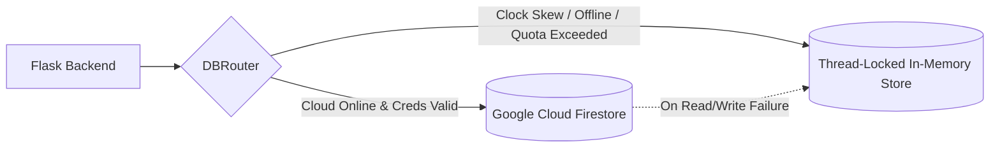

# Presenova: Architecture, Design Decisions & Viva Defense Guide
## "Kya, Kaise, Kyun & Tech Alternatives" (Smart FYP Reference Manual)

> **Document Purpose**: Yeh document Presenova project ka high-yield, smart technical guide hai. Isme har component ka **"Kya hai, Kaise kaam karta hai, Kyun zaroori hai, Iske alternatives kya the, aur wo kyun reject hue"** aasan aur professional andaz me explain kiya gaya hai taake aap FYP viva aur technical defense me 100% confidence ke sath answer kar sakein.

---

## Quick Navigation / Index
1. [Core Architectural Blueprint](#1-system-overview--core-architecture)
2. [Frontend Framework: React 18 + Vite vs Alternatives](#2-frontend-web-react-18--vite)
3. [Backend API Hub: Python Flask vs FastAPI vs Django](#3-backend-api-hub-python-flask)
4. [Real-Time Streaming: WebSockets (Socket.IO) vs WebRTC vs Polling](#4-real-time-streaming-flask-socketio--websockets)
5. [Computer Vision: MediaPipe Face Mesh vs OpenCV Haar vs Dlib vs YOLO](#5-computer-vision-mediapipe-face-mesh-with-iris-tracking)
6. [Speech & Audio Analysis: Groq Whisper API vs Local Whisper vs Google STT](#6-speech-to-text-stt--audio-groq-whisper-lpu)
7. [Scoring Engine: Scikit-Learn Random Forest vs Pure LLMs](#7-scoring-engine-scikit-learn-random-forest-vs-pure-llm)
8. [RAG & Viva Question Generator: FAISS + SentenceTransformers vs Vector DBs](#8-viva-question-rag-sentence-transformers--faiss)
9. [Linguistic Rewriter: spaCy Dependency Parsing vs NLTK vs Regex](#9-slide-deck-rewriter-spacy-nlp-engine)
10. [Document Parsing: Native Parsers + Magic Bytes vs OCR / Apache Tika](#10-document-parsing-engine-python-pptx-pypdf-docx)
11. [Database Strategy: Cloud Firestore + In-Memory Auto-Fallback](#11-database-layer-dual-engine-persistence)
12. [Top 10 Killer FYP Viva Questions & Model Answers](#12-top-10-killer-fyp-viva-defense-questions)

---

## 1. System Overview & Core Architecture

### Q: Presenova kya hai aur kis problem ko solve karta hai?
- **Kya hai**: Presenova ek multi-modal AI presentation rehearsal, telemetry aur real-time coaching platform hai jo slides, speech acoustics, live camera posture, eye contact aur viva cross-examination ko quantitatively evaluate karta hai.
- **Problem**: Insani presentation feedback hamesha subjective (ghair-meyari), inconsistent aur biased hota hai. Students ko defense se pehle pata nahi hota ke unka pacing kaisa hai, gaze kahan hai, filler words kitne hain, aur slides standard rules (jaise 6x6 rule) follow karti hain ya nahi. Presenova ise mathematical aur visual telemetry me convert karta hai.

---

## 2. Frontend Web: React 18 + Vite

### Q: Frontend me kya ho raha hai aur kaise ho raha hai?
- **Kya ho raha hai**: Single Page Application (SPA) jo user authentication, file uploads, real-time live webcam/mic stream, teleprompter, interactive radar charts (Recharts) aur before/after slide diffs render karti hai.
- **Kaise ho raha hai**: Custom React hooks (`useLiveSession.ts`, `useAudioRecorder.ts`) browser ke `navigator.mediaDevices` API se camera frames (3 FPS) aur audio chunks (3-sec interval) capture karke WebSocket ke zariye backend ko push karte hain.

### Q: Yahi tech kyun choose ki aur iske alternatives kyun reject hue?

| Feature / Metric | **React 18 + Vite (Selected)** | **Next.js (App Router)** | **Vue.js / Angular** | **Vanilla JS / HTML** |
| :--- | :--- | :--- | :--- | :--- |
| **Rendering Model** | Pure Client-Side SPA | Server-Side Rendering (SSR) | SPA / Full Framework | Direct DOM Manipulation |
| **Build & HMR Speed** | Millisecond HMR via esbuild | Slower build due to SSR bundling | Good HMR (Vite/Vue) | No build step |
| **Webcam/Socket Handling** | Simple, zero SSR hydration mismatch | Hydration errors with `window`/MediaStream | Works well | Complex state spaghetti |
| **Ecosystem for Charts** | Recharts, Lucide, Tailwind | Same | Smaller chart ecosystem | Manual Canvas/D3.js |

#### Reject hone ki wajohat (Why alternatives were rejected):
1. **Next.js SSR kyu nahi use kiya?**
   - Presenova ek authenticated dashboard hai, koi public SEO blog nahi hai. Next.js ka Server-Side Rendering (SSR) client-side camera (`navigator.mediaDevices`), audio context aur WebSockets ke sath hydration errors paida karta hai (`window is not defined`).
   - Vite pure client SPA bundle banata hai jo zero-config Vercel/Netlify par static CDN se deploy ho jata hai.
2. **Vanilla JS kyu nahi use kiya?**
   - Real-time 478 face-mesh landmarks, audio meter, timer, live hints aur radar charts ko manage karna Vanilla JS me extreme race conditions aur spaghetti code banata. React ka unidirectional state flow aur component modularity ise clean rakhti hai.

---

## 3. Backend API Hub: Python Flask

### Q: Backend me kya ho raha hai aur kaise ho raha hai?
- **Kya ho raha hai**: Central REST API aur WebSocket server jo authentication, upload verification, AI model pipelines, aur document processing ko coordinate karta hai.
- **Kaise ho raha hai**: Flask Blueprints (`auth_bp`, `phase_two_bp`, `phase_live_bp`, etc.) ke zariye modular design hai. Requests ko JWT tokens se secure kiya gaya hai aur rate-limiters laga kar abuse se bachaya gaya hai.

### Q: Python Flask kyun use kiya aur alternatives kyun reject hue?

| Feature | **Flask + Blueprints (Selected)** | **FastAPI (ASGI)** | **Django** | **Node.js (Express)** |
| :--- | :--- | :--- | :--- | :--- |
| **AI / ML Integration** | Native Python (zero IPC overhead) | Native Python | Native Python | IPC bridge needed (Slow) |
| **Execution Model** | Synchronous + Threaded/Gevent | Async / Await Event Loop | Heavy Synchronous / WSGI | Async Event Loop |
| **Footprint & Bloat** | Micro-framework, Zero bloat | Lightweight | Heavy (Unused ORM/Admin) | Lightweight |
| **Socket.IO Stability** | `Flask-SocketIO` + Gevent rock solid | `python-socketio` can block loop | Django Channels (overkill/Redis needed)| Socket.io native |

#### Reject hone ki wajohat:
1. **Node.js kyu nahi use kiya?**
   - Presenova ka core AI hai: MediaPipe, OpenCV, Scikit-Learn, spaCy, PyPDF, FAISS. Agar Node.js use karte to har request par Python script ko `child_process` se call karna parta ya alag microservice banani parti, jisse latency aur RAM consumption double ho jati.
2. **Django kyu nahi use kiya?**
   - Django monolithic hai. Uska built-in ORM, admin panel aur template engine hamare liye fazool bloat tha kyunki database hamara Cloud Firestore aur in-memory store hai.
3. **FastAPI kyu nahi use kiya?**
   - OpenCV, MediaPipe aur Scikit-Learn fundamentally CPU-bound synchronous C-extensions hain. FastAPI ke async event loop par agar CPU-heavy task chale to poora server freeze ho jata hai jab tak thread pool use na kiya jaye. Flask-SocketIO with threading/gevent model CPU-bound computer vision frames ko effortlessly handle karta hai.

---

## 4. Real-Time Streaming: Flask-SocketIO & WebSockets

### Q: Real-time live coaching me kya aur kaise ho raha hai?
- **Kya ho raha hai**: Jab user "Live Practice" karta hai, browser se 3 frames per second (base64 JPEG) aur 3-second audio chunks backend par stream hote hain. Backend usi waqt gaze deviation, posture aur filler words detect karke visual hint ("Look at the camera!", "Pacing is too fast") wapis bhejta hai.
- **Kaise ho raha hai**: Bi-directional full-duplex WebSocket connection (`/ws/live-session`).

### Q: WebSockets kyun use kiye aur alternatives kyun reject hue?

| Method | **WebSockets (Selected)** | **HTTP Polling** | **WebRTC** | **Server-Sent Events (SSE)** |
| :--- | :--- | :--- | :--- | :--- |
| **Latency** | < 50ms (Bi-directional) | 500ms - 2000ms | < 30ms (Peer-to-Peer) | < 50ms (One-way only) |
| **Direction** | Full-Duplex (Both ways) | Half-Duplex (Request/Response) | Full-Duplex Media Streams | Server-to-Client only |
| **Overhead** | Ek baar handshake, zero headers | Har call par HTTP headers/cookies | STUN/TURN server complex setup | Low, but cannot send client frames |
| **Python Inspection** | Direct frame/audio in memory | Inefficient HTTP overhead | Needs C++ media bridge (Janus/Kurento) | N/A |

#### Reject hone ki wajohat:
1. **HTTP Polling kyu nahi?**
   - 3 FPS par HTTP requests bhejne se server par connection exhaustion ho jata aur har frame ke sath 1KB ke HTTP headers waste hote. Latency itni barh jati ke real-time coaching namumkin hoti.
2. **WebRTC kyu nahi?**
   - WebRTC peer-to-peer video streaming ke liye behtareen hai (jaise Zoom), lekin server-side frame-by-frame AI analysis ke liye Python me WebRTC pipeline setup karne ke liye heavy media servers (STUN/TURN/Janus/GStreamer) chahiye hote hain jo FYP deployment ke liye massive overhead tha. WebSockets clean aur light hain.
3. **SSE kyu nahi?**
   - SSE one-way hota hai (server -> client). Client server ko video frames nahi bhej sakta.

---

## 5. Computer Vision: MediaPipe Face Mesh with Iris Tracking

### Q: Vision pipeline me kya aur kaise ho raha hai?
- **Kya ho raha hai**: User ka eye contact, head pose (pitch, yaw, roll), blink rate aur posture composure real-time me track hota hai.
- **Kaise ho raha hai**: MediaPipe Face Mesh 478 3D landmarks extract karta hai. Landmarks 468 se 477 iris (aankh ki putli) ke hain. Iris ka center point dono eye corners (inner and outer canthi) ke reference se Euclidean distance calculate karke gaze direction (Center, Left, Right, Down) measure karta hai.

### Q: MediaPipe kyun use kiya aur alternatives kyun reject hue?

| Library | **MediaPipe Face Mesh (Selected)** | **OpenCV Haar Cascades** | **Dlib (68 Landmarks)** | **YOLOv8-Face** |
| :--- | :--- | :--- | :--- | :--- |
| **Landmark Count** | **478 3D points** (Includes Iris) | 0 (Only bounding box rectangle) | 68 2D points (No Iris) | Bounding box + 5 points |
| **Gaze Accuracy** | High (Exact pupil/iris center) | None (Cannot detect gaze) | Low (Estimated from eye contour) | None |
| **CPU Performance**| Ultra-fast (30+ FPS on laptop CPU)| Extremely fast | Very slow on CPU without GPU | Needs GPU / High VRAM |
| **Installation** | Pure `pip install mediapipe` | Built-in OpenCV | Needs CMake & C++ compiler | Heavy PyTorch dependency |

#### Reject hone ki wajohat:
1. **OpenCV Haar Cascade akele kyu nahi?**
   - Haar Cascade sirf chehre ka rectangular box batata hai. Ye nahi bata sakta ke user screen dekh raha hai, camera dekh raha hai, ya neeche notes parh raha hai. (Hamne OpenCV ko sirf fallback rakha hai agar MediaPipe crash kare).
2. **Dlib kyu nahi use kiya?**
   - Dlib ko compile karne ke liye Windows par CMake aur Visual Studio C++ build tools chahiye hote hain (deployment nightmare). Dlib me iris landmarks nahi hote, sirf 68 outer points hote hain jo precise gaze ke liye na-kafi hain.
3. **YOLO kyu nahi?**
   - YOLO object detection model hai, gaze tracking ke liye nahi bana. Ye GPU maangta hai aur container size 2GB barha deta.

---

## 6. Speech-to-Text (STT) & Audio: Groq Whisper LPU

### Q: Speech analysis me kya aur kaise ho raha hai?
- **Kya ho raha hai**: Audio file ya live 3-second audio chunks text me convert hote hain. Uske baad speech pace (Words Per Minute - WPM), filler words count (`um`, `uh`, `like`, `actually`), clarity aur articulation score calculate hoti hai.
- **Kaise ho raha hai**: Audio ko Groq Whisper API (`whisper-large-v3`) par pass kiya jata hai jo specialized LPU hardware par chalti hai.

### Q: Groq Whisper kyun use kiya aur alternatives kyun reject hue?

| Solution | **Groq Whisper Large-v3 (Selected)** | **Local Whisper (PyTorch)** | **Google Cloud Speech API** | **Browser Web Speech API** |
| :--- | :--- | :--- | :--- | :--- |
| **Latency** | **< 400 milliseconds** | 5 – 12 seconds on CPU | 1 – 2 seconds | Real-time (Client) |
| **Hardware Required**| Zero (Cloud LPU inference) | 6GB+ Dedicated GPU (VRAM) | Zero (Cloud) | Client Device CPU |
| **Accuracy** | SOTA (whisper-large-v3) | Same (if large model used) | Moderate on technical terms | Poor on non-native accents |
| **Cost / Limits** | Generous free tier for FYP | Free (but melts CPU) | Expensive paid billing | Free |
| **Cross-Browser** | 100% works everywhere | 100% works | 100% works | Fails on Firefox/Safari |

#### Reject hone ki wajohat:
1. **Local Whisper (PyTorch) kyu nahi chalaya?**
   - `whisper-large-v3` ko agar local laptop CPU par chalayein to 3 second ki audio ko transcribe karne me 8-10 seconds lagte hain! Live teleprompter me 10 second delay system ko useless bana deta. Groq ke LPUs (Language Processing Units) wahi transcription 350ms me return karte hain.
2. **Browser Web Speech API kyu nahi use ki?**
   - Browser ki speech API Firefox aur Safari par kaam nahi karti, Urdu/Pakistani accents par fail ho jati hai, aur server ko raw audio nahi milta acoustic analysis ke liye.

---

## 7. Scoring Engine: Scikit-Learn Random Forest vs Pure LLM

### Q: Scoring engine me kya aur kaise ho raha hai?
- **Kya ho raha hai**: Har presentation slide deck aur speech ko **7Cs of Communication** (Clarity, Conciseness, Completeness, Correctness, Concreteness, Consideration, Courtesy) par 0-100 score assign hota hai.
- **Kaise ho raha hai**: `nlp_module` 19 handcrafted linguistic features extract karta hai (Flesch-Kincaid Readability, Lexical Diversity/TTR, Sentiment Polarity, Passive Voice Ratio, Bullet Count Density, etc.). Phir ek pre-trained Scikit-Learn `RandomForestRegressor` ensemble in features ko 7Cs scores me map karta hai.

### Q: Random Forest kyun use kiya aur LLMs (GPT-4/Gemini) se direct score kyun nahi karwaya?

| Criterion | **Random Forest (`trained_weights.pkl`)** | **Commercial LLM Prompting** | **Rule-Based (Pure if-else)** |
| :--- | :--- | :--- | :--- |
| **Determinism** | **100% Mathematical & Reproducible** | Inconsistent (different score every run) | Rigid, cannot handle nuance |
| **Latency** | **< 3 milliseconds** | 2000ms – 5000ms | < 1 millisecond |
| **Cost & Internet** | **Zero cost, Works 100% Offline** | High API token cost, Needs Internet | Zero cost, Offline |
| **Academic Value** | Real ML model training & feature engineering | Just an API wrapper call | No Machine Learning |

#### Reject hone ki wajohat:
1. **LLM se direct score kyu nahi liya?**
   - **Inconsistency (Hallucination)**: Agar examiner ek hi slide 2 dafa upload kare aur LLM ek dafa 70 de aur doosri dafa 85, to project ki credibility khatam ho jati. Random Forest deterministic hai.
   - **Cost & Rate Limits**: Har slide ke har aspect ko LLM se score karwana rate limits hit kar deta hai.
   - **Viva Defense Argument**: External examiner hamesha poochta hai: *"Aapne khud kya ML train kiya ya sirf OpenAI ki API call ki?"* Random Forest 19 features par trained model hai jo genuine data science ko prove karta hai.

---

## 8. Viva Question RAG: Sentence-Transformers + FAISS

### Q: Viva Question Generator me kya aur kaise ho raha hai?
- **Kya ho raha hai**: User ki presentation ka content parh kar external defense panelist jaise tough questions generate hote hain (Categorized into: Methodology, Claims, Architecture, Edge Cases).
- **Kaise ho raha hai**: Presentation ke text ko 200-word chunks me divide karke `all-MiniLM-L6-v2` se 384-dimensional dense vectors banaye jate hain. FAISS (`IndexFlatIP`) cosine similarity se most critical technical claims retrieve karta hai aur unke target questions synthesize karta hai.

### Q: FAISS + SentenceTransformers kyun aur cloud vector databases kyun nahi?

| Vector Engine | **FAISS + Local SentenceTransformers** | **Pinecone / Weaviate Cloud** | **ChromaDB** | **BM25 Keyword Search** |
| :--- | :--- | :--- | :--- | :--- |
| **Setup & Hosting** | In-Memory (Zero external servers) | Cloud account, API keys, Paid | Local SQLite/DuckDB files | Inverted index |
| **Latency** | **Sub-millisecond (< 2ms)** | 100ms - 300ms network roundtrip | 10ms - 30ms | < 5ms |
| **Offline Support**| 100% Offline capable | Fails without internet | Offline capable | Offline capable |
| **Semantic Quality**| Dense contextual embeddings | Dense contextual embeddings | Dense contextual embeddings| Exact keyword match only (Fails synonyms) |

#### Reject hone ki wajohat:
1. **Pinecone kyu nahi use kiya?**
   - Pinecone cloud-hosted hai. Agar internet slow ho ya API key expire ho to viva generation ruk jati. FAISS RAM me chalta hai with zero network latency.
2. **BM25 keyword search kyu nahi?**
   - BM25 sirf exact matching words dhoondta hai. Agar slide me likha ho *"CNN optimization"* aur query ho *"computer vision tuning"*, BM25 fail ho jata jabke SentenceTransformers semantic match kar lete hain.

---

## 9. Slide Deck Rewriter: spaCy NLP Engine

### Q: Rewriter me kya aur kaise ho raha hai?
- **Kya ho raha hai**: Boring, lambi aur passive voice wali slides ko automatically short, active voice aur **6x6 presentation rule** (max 6 bullets per slide, max 6 words per bullet) ke mutabiq redesign karta hai.
- **Kaise ho raha hai**: `spaCy` (`en_core_web_sm`) dependency tree parser grammatical tags nikalta hai:
  - `nsubjpass` (passive subject)
  - `auxpass` (passive auxiliary verb jaise *is/was/been*)
  - `agent` (prepositional phrase jaise *by the team*)
  Inhe systematically active voice me invert kiya jata hai.

### Q: spaCy kyun use kiya aur alternatives kyun reject hue?

| Feature | **spaCy Dependency Parser (Selected)** | **NLTK** | **Regex (Regular Expressions)** |
| :--- | :--- | :--- | :--- |
| **Syntactic Parsing** | Industrial-grade Dependency Graph | Basic Context-Free Grammar (CFG) | None (String patterns only) |
| **Speed** | Blazing C-extensions (Cython) | Slow Python classes | Very fast but dumb |
| **Passive Detection** | Exact grammatical subject-agent link | Requires hand-crafted grammar trees | Fails on complex sentences |

#### Reject hone ki wajohat:
1. **Regex kyu nahi?**
   - Regex grammar nahi samajh sakta. Regex *"The boy was helped by his friend"* (passive) aur *"The boy was happy by the lake"* (active) ke farq ko nahi pehchan sakta.
2. **NLTK kyu nahi?**
   - NLTK 20 saal puraana educational tool hai. Industrial syntactic dependency parsing ke liye spaCy 10x fast aur accurate hai.

---

## 10. Document Parsing Engine: python-pptx, pypdf, docx

### Q: Document analysis me kya aur kaise ho raha hai?
- **Kya ho raha hai**: `.pptx`, `.pdf`, `.docx`, aur `.txt` files upload hoti hain. System unka structural data, slide titles, bullet hierarchies, tables aur embedded word counts extract karta hai.
- **Kaise ho raha hai**: File type verify karne ke baad native Python XML parsers call hote hain.

### Q: Native Parsers + Magic Bytes kyun aur OCR / Apache Tika kyun nahi?

| Engine | **Native Python Parsers (Selected)** | **OCR (Tesseract / EasyOCR)** | **Apache Tika** |
| :--- | :--- | :--- | :--- |
| **Speed** | Milliseconds (< 50ms) | Seconds to minutes (Very slow) | 200ms - 500ms |
| **Dependencies** | Pure Python libraries | C++ binary, Tesseract engine | Requires Java Runtime (JVM) |
| **Accuracy** | 100% Exact digital character streams| 85-95% (Prone to typos/character cuts)| High |
| **Security** | Magic-byte signature checked first | Raw image processing | Java vulnerabilities (Log4j risk) |

#### Reject hone ki wajohat:
1. **OCR kyu nahi lagaya?**
   - PPTX aur PDF files me text pehle se digitally encoded XML/text stream hota hai. Usko pehle image banana aur phir OCR se parhna CPU waste karna hai aur typos paida karta hai.
2. **Apache Tika kyu nahi?**
   - Tika ko run karne ke liye server par Java (JRE) install karni parti hai jisse container size 500MB barh jata hai.
3. **Magic-Byte Signature Verification kyu lagai?**
   - *Security Defense Point*: Agar koi hacker `malicious_script.exe` ka naam badal kar `presentation.pptx` karke upload kare, to extension check dhoka kha jayega. Presenova file ke pehle 4 bytes (e.g. `PK\x03\x04` for zip/pptx, `%PDF-` for pdf) verify karta hai taake remote code execution attack block ho sake.

---

## 11. Database Layer: Dual-Engine Persistence

### Q: Database me kya ho raha hai aur ye "Dual-Engine" kya hai?
- **Kya ho raha hai**: User profiles, uploads, presentation scorecards aur historical sessions ko save kiya jata hai.
- **Kaise ho raha hai**: `models.py` me custom `DBRouter` likha gaya hai:
  - **Primary Engine**: Google Cloud Firestore (NoSQL cloud persistence).
  - **Fallback Engine**: Thread-Locked In-Memory Store (`_MEMORY_STORE`).

### Q: Dual-Engine kyun banaya aur standard SQL (PostgreSQL/MySQL) kyun nahi?
1. **Viva Defense Winner (Zero-Crash Guarantee)**:
   - Aksar FYP presentations me university Wi-Fi disconnect ho jata hai ya laptop ka system clock skew ho jata hai jisse Google Cloud IAM credentials fail ho jate hain (`invalid_grant: Invalid JWT: Token used too early/late`).
   - Normal systems is par crash ho jate hain (`500 Internal Server Error`).
   - Presenova bina crash hue **< 0.5s me automatically in-memory store par switch ho jata hai**, aur demo flawlessly chalta rehta hai!
2. **PostgreSQL/MySQL kyu nahi?**
   - Relational DBs ke liye server provisioning, port mapping, connection pooling aur continuous migration files manage karni parti hain. Firestore NoSQL JSON documents presentation slides aur scorecards ke unstructured hierarchical data ke liye perfectly fit hain.

---

## 12. Top 10 Killer FYP Viva Defense Questions

Yeh wo 10 sawalaat hain jo external examiner 100% poochte hain. Inke smart answers memorize kar lein:

### Q1: "Aapke system me AI kahan hai aur rules kahan hain?"
> **Answer**: Hamara system ek hybrid architecture hai. 
> - **AI/ML Layer**: MediaPipe Face Mesh (Deep Learning vision model for 478 landmarks), Groq Whisper-large-v3 (transformer-based acoustic model for STT), Scikit-Learn Random Forest Regressor (ensemble ML for 7Cs scoring), aur SentenceTransformers (dense vector embeddings for RAG).
> - **Deterministic Rules Layer**: 6x6 rule enforcement, magic-byte file signature validation, spaCy dependency tree grammar conversion, aur mathematical WPM formulas. AI provides perception and scoring; rules provide guardrails and structure.

### Q2: "MediaPipe me iris landmarks (468–477) se gaze kaise calculate hoti hai?"
> **Answer**: MediaPipe eye corner landmarks (inner canthus aur outer canthus) ke 3D coordinates deta hai. Ham in dono ke darmiyan center point calculate karte hain aur phir iris center landmark (468 left, 473 right) ka horizontal aur vertical displacement Euclidean distance formula se measure karte hain. Agar displacement predefined threshold se exceed kare to system detect kar leta hai ke speaker camera se bahar dekh raha hai.

### Q3: "Real-time live session me audio chunks 3-second ke kyun hain, 1-second ya 10-second ke kyun nahi?"
> **Answer**: 
> - Agar 1-second rakhein to chunk me sirf 1 ya 2 words aate hain jisse Whisper acoustic context samajh nahi pata aur filler phrases jaise *"you know"* adhoori kat jati hain.
> - Agar 10-second rakhein to teleprompter par feedback aate aate 10 seconds guzar jayenge jo real-time feedback nahi rehta.
> - 3 seconds is the mathematical sweet spot: isme average 6-8 words aate hain jo complete sentence fragments banate hain aur latency under 400ms rehti hai.

### Q4: "Agar Google Firestore disconnect ho jaye ya internet band ho jaye to presentation data ka kya banta hai?"
> **Answer**: Hamne `models.py` me `DBRouter` implement kiya hai jo auto-failover mechanism use karta hai. Firestore connection fail hote hi system thread-locked `_MEMORY_STORE` me write karna shuru kar deta hai. Client ko koi error 500 nazar nahi aata aur rehearsal session seamlessly complete hota hai.

### Q5: "Groq Whisper API use karne ka fayda jab OpenAI ki API bhi maujood hai?"
> **Answer**: Dono `whisper-large-v3` architecture use karti hain, lekin hardware ka farq hai. OpenAI standard GPUs par chalta hai jiski response latency 2-4 seconds hoti hai. Groq ne custom LPUs (Language Processing Units) design kiye hain jo high-bandwidth tensor streaming karte hain. Groq par wahi model 350-400ms me output deta hai, jo live teleprompter ke liye critical hai.

### Q6: "Aapne scoring ke liye Random Forest ko neural network par tarjeeh kyun di?"
> **Answer**: Hamare feature vector ka size 19 tabular features hai. Tabular data par Multi-Layer Perceptrons (MLP) ya deep neural networks overfit ho jate hain aur unhe massive training data aur GPU chahiye hota hai. Random Forest ensemble 100 decision trees ka vote leta hai, outliers aur non-linear correlations ko gracefully handle karta hai, aur CPU par 3 milliseconds me inference deta hai.

### Q7: "Presentation rewriter me passive-to-active voice convert karne ke liye LLM prompt kyun nahi likha?"
> **Answer**: LLMs unpredictable hote hain—wo slide ka context badal dete hain, naye technical terms hallucinate kar lete hain, aur slide formatting destroy kar dete hain. `spaCy` dependency tree parsing ke zariye hum exact grammatical subject (`nsubjpass`), verb aur agent ko mathematically swap karte hain baghair content ka meaning ya terminology badle.

### Q8: "FAISS vector database ko chalane ke liye GPU chahiye?"
> **Answer**: Nahi, hamne FAISS ka CPU-optimized index (`IndexFlatIP` - Flat Inner Product) use kiya hai. Normal presentations me 10 se 50 slides hoti hain jinke chunks 100 se kam hote hain. Is scale par FAISS CPU ke AVX2 instructions par memory-mapped vectors ko sub-millisecond me search kar leta hai, isliye expensive GPU ki zaroorat nahi parti.

### Q9: "Security ke aitbar se presentation upload me sab se bara threat kya hota hai aur aapne kaise roka?"
> **Answer**: Sab se bara threat **Unrestricted File Upload / Remote Code Execution** hota hai, jahan attacker script file ko `.pptx` ya `.pdf` ka naam de kar upload kar deta hai. Hamne do-level security lagai hai:
> 1. Strict filename sanitization using `werkzeug.utils.secure_filename` aur random UUID isolation directory.
> 2. **Magic-Byte Signature Verification**: Extension par trust kiye baghair raw binary bytes check hote hain (`PK\x03\x04` for PPTX, `%PDF-` for PDF). Agar bytes match na hon to server upload foran reject kar deta hai.

### Q10: "Live cross-examination interruption feature kis base par trigger hota hai?"
> **Answer**: Do conditions par:
> 1. **High Filler Density**: Agar speaker ke 3-second chunks me filler words ki ratio ek threshold se exceed kar jaye (speaker nervous ya lost feel ho raha ho).
> 2. **Periodic Presentation Checkpoint**: Presentation ke darmiyan regular intervals par simulated senior professor AI user ko interrupt karke content ke mutabiq direct defense question puchti hai, aur user ke jawab ko clarity aur technical depth par grade karti hai.

---

## 13. Summary Cheatsheet (Quick Recall)

| Problem Area | Presenova Solution | Key Alternative Considered | Why Presenova Won |
| :--- | :--- | :--- | :--- |
| **Gaze & Pose Tracking** | MediaPipe Face Mesh (478 pts) | OpenCV Haar / Dlib | 478 3D points + iris center vs eye contour distance |
| **Real-Time Speech STT** | Groq Whisper Large-v3 | Local Whisper / Google STT | Sub-400ms latency on Groq LPUs without local GPU load |
| **Slide & Speech Scoring** | Random Forest (19 features) | Direct GPT-4 Prompting | 100% deterministic, offline, free, genuine trained ML |
| **Viva Defense RAG** | SentenceTransformers + FAISS | Pinecone / Weaviate | Embedded in RAM, zero cloud dependency, < 2ms retrieval |
| **Slide Grammar Rewriting**| spaCy Dependency Parser | Pure Regex / LLM Rewrite | Accurate syntactic parsing (`nsubjpass`) without hallucination |
| **Real-Time Channel** | Flask-SocketIO (WebSockets) | HTTP Polling / WebRTC | Full duplex, low overhead, frame-by-frame Python inspection |
| **Persistence Resiliency** | Firestore + `_MEMORY_STORE` | PostgreSQL / SQLite alone | 100% uptime: never crashes if cloud auth/network drops |
| **File Security** | Magic-Byte Signature Check | File Extension Check | Blocks disguised executable malware payloads |

---
*Presenova FYP Documentation — Designed for High-Impact Technical Defense and Architecture Audits.*
